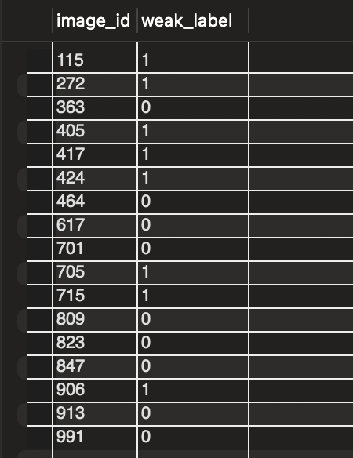
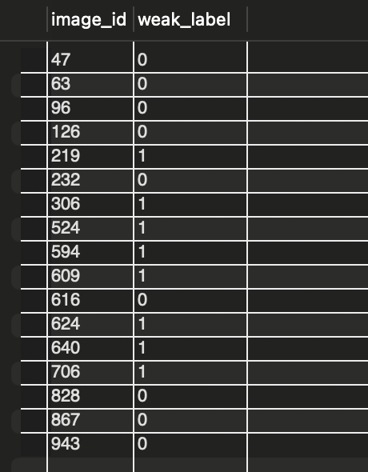

# Task 1

## Question

We have:
1. a machine learning binary classifier which takes as input an image and outputs the image quality score (from 0 to 1, where scores closer to O represent low-quality images, and scores closer to 1 represent high-quality images).
2. a SQL table containing 1M unlabeled images. We run each of these images through our machine learning model to get float scores from 0 to 1 for each image.

We want to prepare a new training set with some of these unlabeled images. An example of unlabeled_image_predictions (1M rows) is shown below:

## Sampeling Strategy

Our sampling strategy is to order the images in decreasing order of scores and sample every 3rd image starting with the first from the beginning until we get 10k positive samples. And we would like to do the same in the other direction, starting from the end to get 10k negative samples.


## Task

 Write a SQL query that performs this sampling and creates the expected output ordered by image_id with integer columns image_id, weak_label.


# Positive Sampling

## Approach

1. Inside the subquery, the `ROW_NUMBER()` window function is used to assign a row number to every row after sorting it based on the `score` in decreasing order.
2. The row number (`seq`) is then used to filter every third row starting from the first by applying the condition `(seq % 3 = 1)`.
3. The resultant table is ordered by `image_id`, and a maximum of 10,000 entries are selected using `LIMIT`.
4. A `weak_label` column is added by rounding off the `score` using the `ROUND()` function.

## SQL Query

```sql
SELECT image_id,
       IF(ROUND(score) = 0, 0 , 1) AS weak_label
FROM (
    SELECT image_id, score,
           ROW_NUMBER() OVER (ORDER BY score DESC) AS seq
    FROM unlabeled_image_predictions
) AS x
WHERE seq % 3 = 1
ORDER BY image_id
LIMIT 100000;
```

## OUTPUT



# Negative Sampling

## Approach

1. Inside the subquery, the `ROW_NUMBER()` window function is used to assign a row number to every row after sorting it based on the `score` in increasing order.
2. The row number (`seq`) is then used to filter every third row starting from the first by applying the condition `(seq % 3 = 1)`.
3. The resultant table is ordered by `image_id`, and a maximum of 10,000 entries are selected using `LIMIT`.
4. A `weak_label` column is added by rounding off the `score` using the `ROUND()` function.

## SQL Query

```sql
SELECT image_id,
       IF(ROUND(score) = 0, 0 , 1) AS weak_label
FROM (
    SELECT image_id, score,
           ROW_NUMBER() OVER (ORDER BY score) AS seq
    FROM unlabeled_image_predictions
) AS x
WHERE seq % 3 = 1
ORDER BY image_id
LIMIT 100000;
```
## OUTPUT



