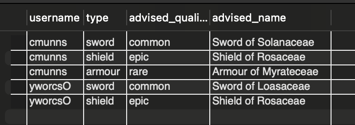

# MMORPG Database 

## Overview
This database is designed for a Massively Multiplayer Online Role-Playing Game (MMORPG). It consists of three primary tables:
1. **accounts**: Stores user information.
2. **items**: Stores different types of items available in the game.
3. **accounts_items**: Establishes a relationship between accounts and items, tracking item ownership and quality.

## Database Schema

```sql
CREATE DATABASE MMORPG;
USE MMORPG;

CREATE TABLE accounts(
  id INT NOT NULL PRIMARY KEY,
  username VARCHAR(255)
);

CREATE TABLE items(
  id INT NOT NULL PRIMARY KEY,
  type ENUM('sword', 'shield', 'armour'),
  name VARCHAR(255)
);

CREATE TABLE accounts_items(
  account_id INT,
  item_id INT,
  quality ENUM('common', 'rare', 'epic'),
  FOREIGN KEY(account_id) REFERENCES accounts(id),
  FOREIGN KEY(item_id) REFERENCES items(id)
);
```

## Sample Data
### Populating `accounts` Table
```sql
INSERT INTO accounts(id, username)
VALUES (1, 'cmunns'), (2, 'yworcsO');
```

### Populating `items` Table
```sql
INSERT INTO items(id, type, name)
VALUES (1, 'sword', 'Sword of Solanaceae'),
       (2, 'shield', 'Shield of Rosaceae'),
       (3, 'shield', 'Shield of Fagaceae'),
       (5, 'shield', 'Shield of Lauraceae'),
       (6, 'sword', 'Sword of Loasaceae'),
       (7, 'armour', 'Armour of Myrateceae'),
       (8, 'shield', 'Shield of Rosaceae'),
       (10, 'shield', 'Shield of Rosaceae');
```

### Populating `accounts_items` Table
```sql
INSERT INTO accounts_items(account_id, item_id, quality)
VALUES (1, 10, 'epic'),
       (1, 2, 'rare'),
       (1, 2, 'rare'),
       (1, 7, 'rare'),
       (1, 1, 'common'),
       (1, 2, 'common'),
       (1, 3, 'common'),
       (1, 5, 'common'),
       (1, 8, 'common'),
       (2, 8, 'epic'),
       (2, 5, 'rare'),
       (2, 3, 'common'),
       (2, 6, 'common');
```


## Query
```sql
SELECT username, type, quality AS advised_quality, name AS advised_name
FROM accounts
RIGHT JOIN (
    SELECT account_id, type, quality, name,
           DENSE_RANK() OVER(PARTITION BY account_id, type ORDER BY FIELD(quality, 'common', 'rare', 'epic') DESC) AS seq
    FROM (
        SELECT account_id, type, quality, name
        FROM accounts_items
        LEFT JOIN items ON id = item_id
    ) AS dummy
) AS x
ON id = account_id
WHERE seq = 1
ORDER BY username, type;
```

### Approach
1. **Join `accounts_items` with `items`**: This step fetches item details (type and name) along with their quality for each account.
2. **Use `DENSE_RANK()`**:
   - Partition by `account_id` and `type` to rank items within each category.
   - Order using `FIELD(quality, 'common', 'rare', 'epic') DESC`, ensuring 'epic' is ranked highest.
3. **Filter for best-ranked items**: The outer query filters only the top-ranked item for each player per type (`seq = 1`).
4. **Right join with `accounts`**: Ensures all accounts are included, even if they do not own items.
5. **Sort by username and item type**: Provides an organized result.

## Output

